# 🕌 Islami App (Flutter)

A multi-language Flutter application featuring Quran, Hadith, Sepha, Prayer Times and Islamic reminders with a clean, user-friendly interface.

  

---

## 📹 App Demo:
- watch this video:

https://www.loom.com/share/20ad55398e3644c79fa69fcf4e2c8878?sid=cd88f775-c7f2-4448-9676-9ac726aa8a56

---

## 🚀 Features

- 👋 Onboarding flow for new users
- 🏠 Bottom navigation with:
    - Quran
    - Hadith
    - Sepha
    - Radio
    - Prayer Times and Islamic reminders
- 💾 Save the last suras that the user read
- 🔍 Search for any sura by its arabic or english name
- 📻 Listen to the live islamic radio

---

## 📸 Screenshots

### 👋 Onboarding

  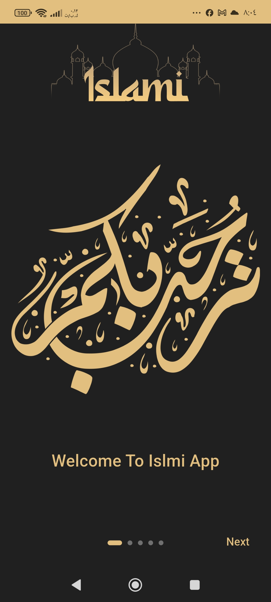
  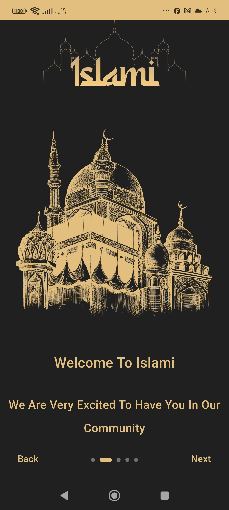
  
  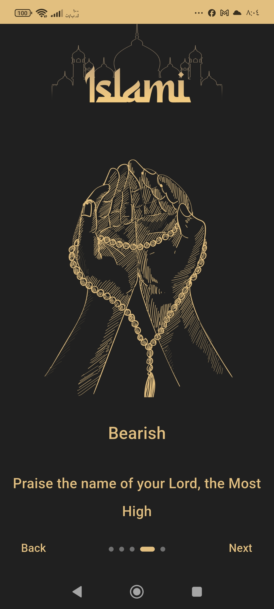
  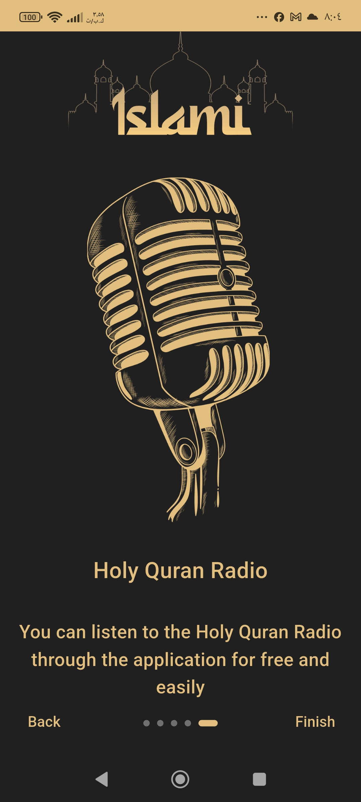

### 📖 Quran

  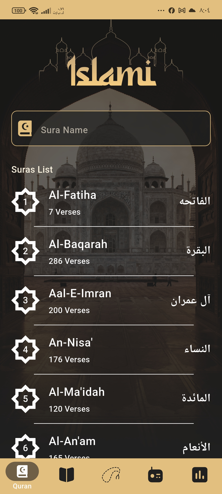
  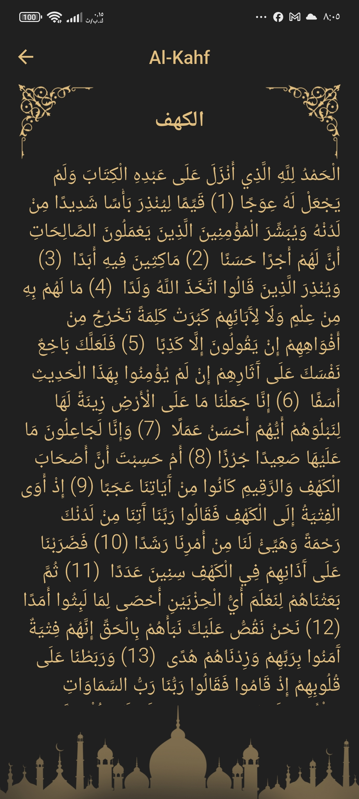

### 🕰️ Most Recent

  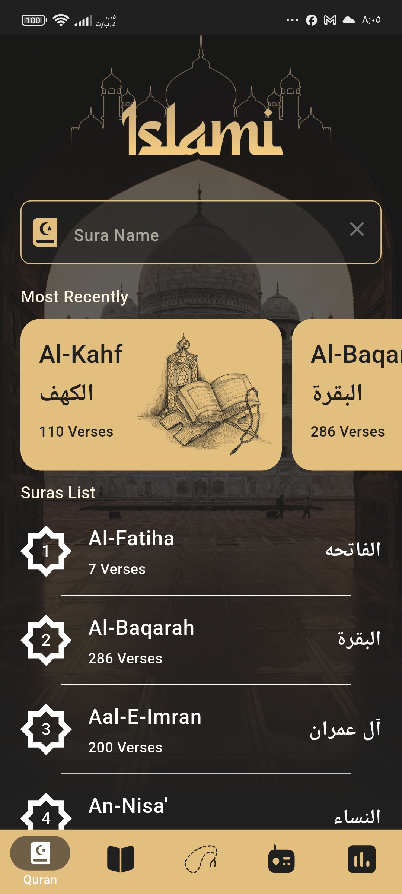

### 🔍 Search

  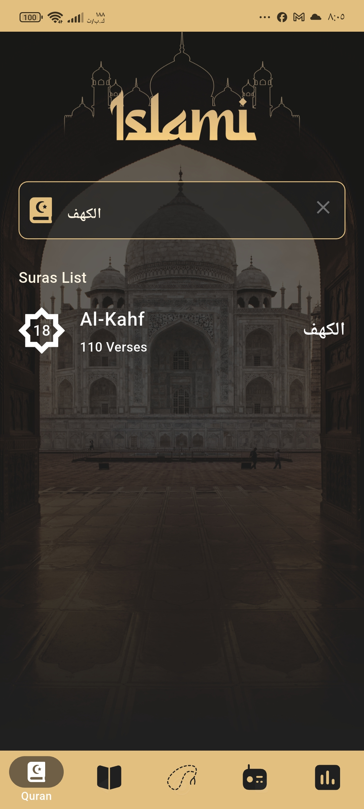

### 📜 Hadith

  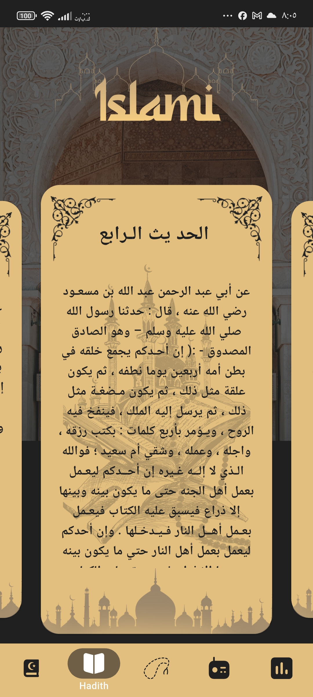

### 🧮 Sebha

  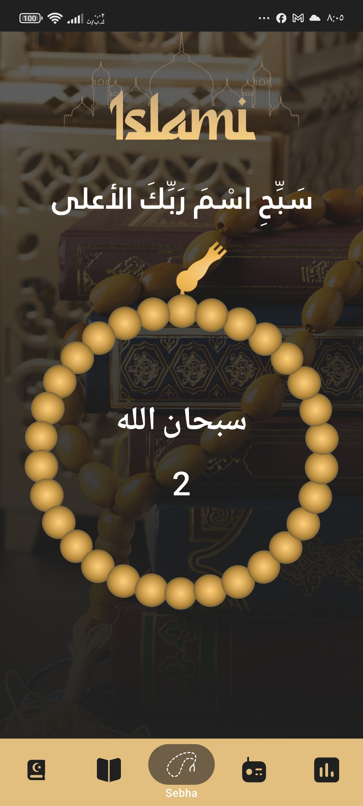
  

### 📻 Radio

  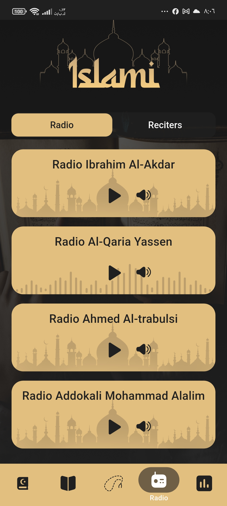

### 🕒 Prayer Times

  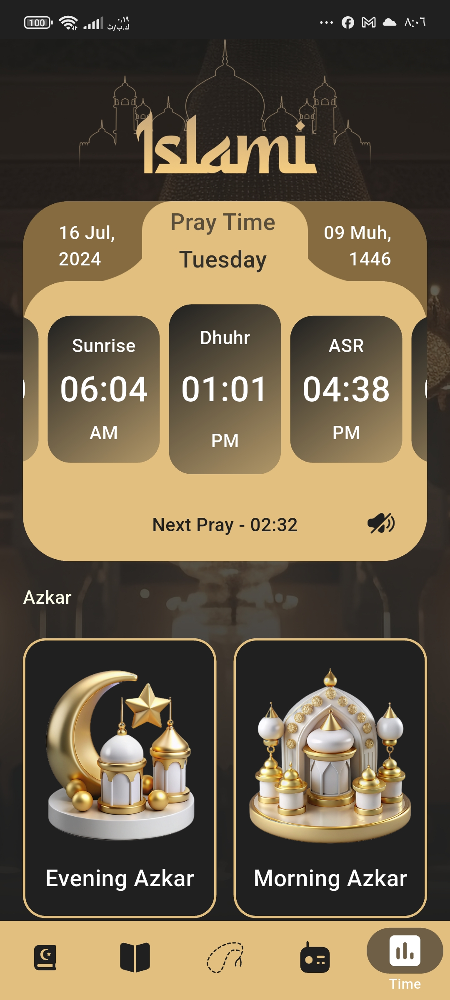

